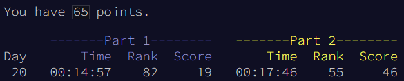

# 🎄 Advent of Code 2022 - day 20 🎄

## Info

Task description: [link](https://adventofcode.com/2022/day/20)

## Notes

### WHAT?!

I got rank #55 **IN THE WORLD** for both parts!

I had completely ruled out this possibility when I began AoC in 2021. I like starting at midnight and going fast, but I am no hardcore speedrunner. I spend more time than necessary writing my initial solution, even if I refine it later. To think I could have shaved off a couple of minutes if I knew top 100 was a possibility!

I didn't even have a perfectly smooth process. I was stuck for a bit when moving a number to the beginning instead of the end of the array[^1]. But I guess I did everything else pretty painlessly, even when I expected the twist in part 2 to break everything (it didn't!?).

I'm stunned, and really happy.

https://adventofcode.com/2022/leaderboard/day/20

[^1]: This ended up not even being necessary! Since the answer is based on the index of the number 0, the start and the end of the array are irrelevant.
