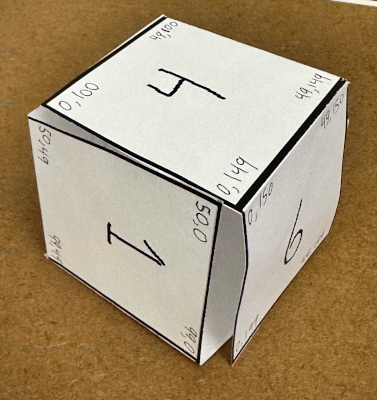

# 🎄 Advent of Code 2022 - day 22 🎄

## Info

Task description: [link](https://adventofcode.com/2022/day/22)

## Notes

Heck of a part 2. I don't know if it was realistic to come up with a way to automatically map the edges of the sides in the correct ways, but hell if I was going to do that. I manually figured out the necessary transformations for X, Y, and direction when crossing sides and stored it all in a constant. I did not bother doing it for the example input cube. That made it harder to debug, but I powered through!

I had only a couple missteps in part 2. The first was passing in the already-transformed X coordinate into the function for transforming the Y coordinate. The other bug was simply having written the wrong transformation function for one of the sides.

I don't feel like refactoring the re-used code.
